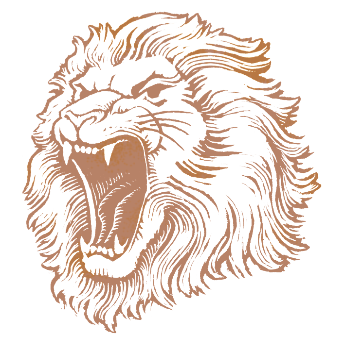
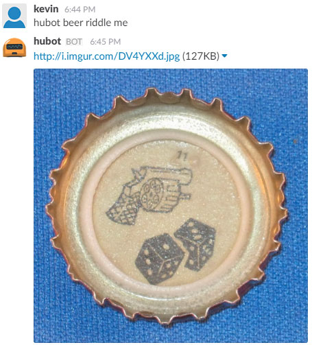

# hubot-beer-riddles

Deluxe pilsner beer riddles

See [`src/beer-riddles.coffee`](src/beer-riddles.coffee) for full documentation.



## Installation

In hubot project repo, run:

`npm install hubot-beer-riddles --save`

Then add **hubot-beer-riddles** to your `external-scripts.json`:

```json
["hubot-beer-riddles"]
```

## Sample Interaction


